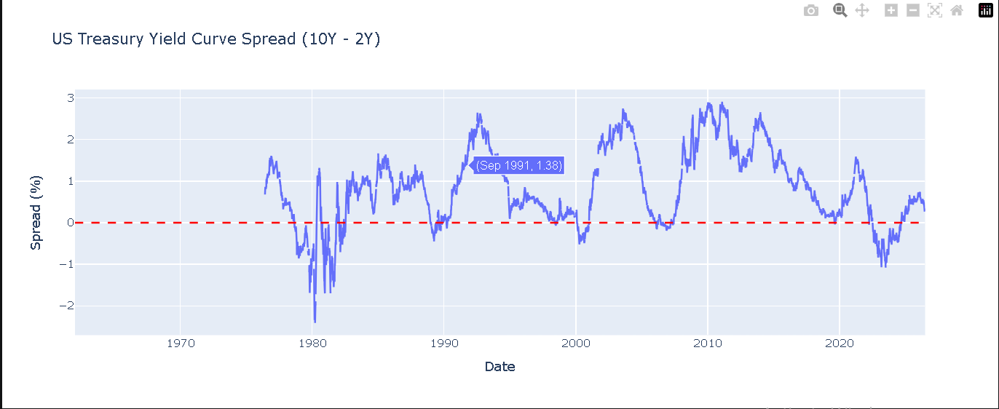
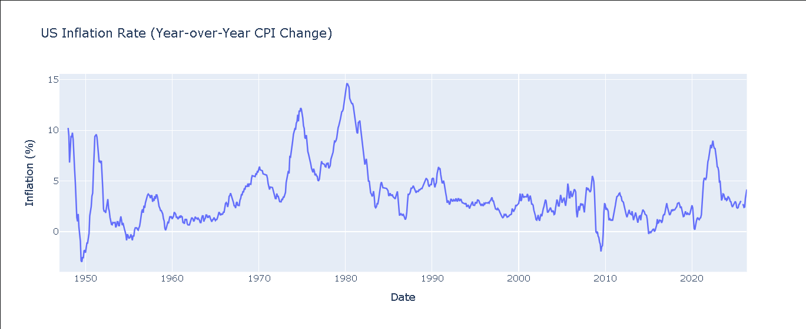
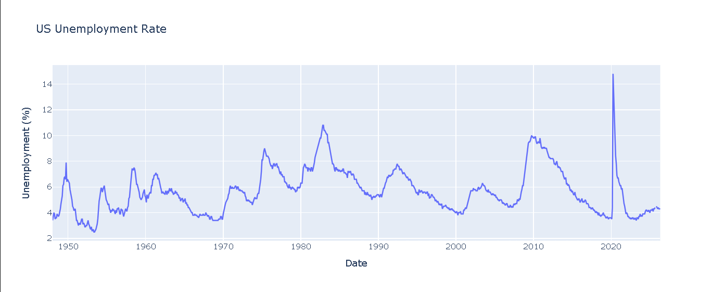
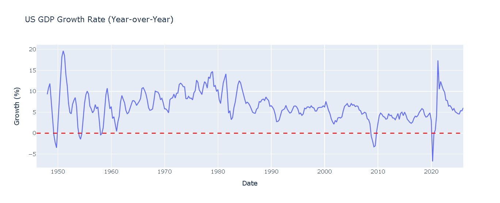

# US Macroeconomic Dashboard 🌍

A Python based dashboard tracking four key US macroeconomic indicators in real time using the FRED API (Federal Reserve Economic Data).

## 📊 Dashboard Preview

### 1. Yield Curve Spread (10Y - 2Y Treasury)

### 2. Inflation Rate (Year-over-Year CPI)

### 3. Unemployment Rate

### 4. GDP Growth Rate

## Indicators Tracked
- 📈 Yield Curve Spread with automatic recession flag
- 💰 Inflation Rate (Year-over-Year CPI)
- 👷 Unemployment Rate
- 📊 GDP Growth Rate (Year-over-Year)

## Tools Used
- Python
- FRED API (fredapi)
- pandas
- Plotly

## About
Built by Ahmed Shareek

## How to Run
1. Clone the repo
2. Get a free API key at fred.stlouisfed.org
3. Replace `YOUR_API_KEY_HERE` in the notebook with your key
4. Run all cells in order
